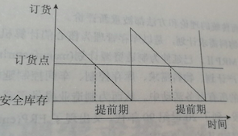
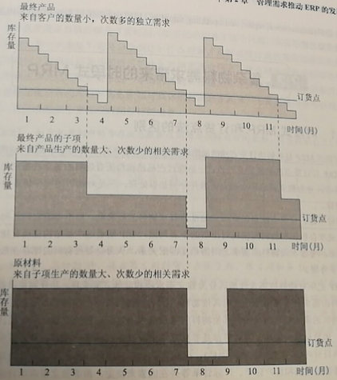
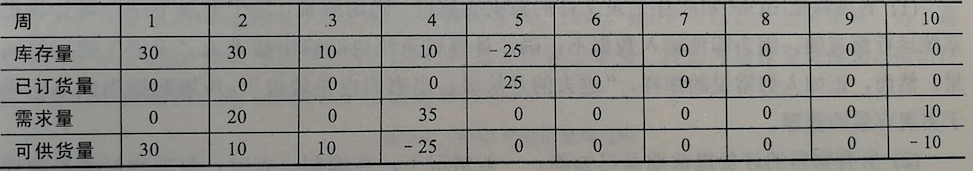
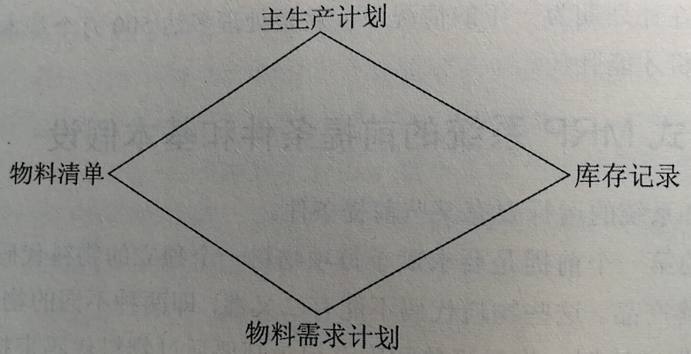
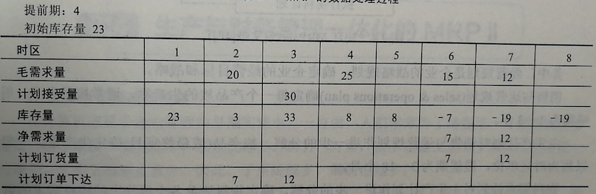
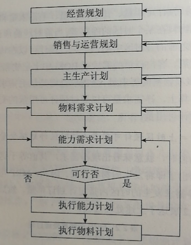

```{r setup, include=FALSE}
library(knitr)
library(kableExtra)

options(htmltools.dir.version = FALSE)
knitr::opts_chunk$set(tidy = FALSE, echo=FALSE, message=FALSE, warning=FALSE, fig.align='center')
```


## 企业的运营目标

--

- 在给定资金、设备、人力的前提下，追求尽可能大的有效产出
- 在市场容量的限制下，尽可能减少人力、物力
- 最求最佳的投入、产出比

--
.quote[
追求利润、追求企业资源的合理有效利用
]

---
## 企业管理者面临的挑战

- 生产计划的合理性
- 成本的有效控制
- 设备的充分利用
- 作业的均衡安排
- 库存的合理管理
- 财务状况的及时分析

---
## 库存管理

- 在这些理论和实践中， 首先提出且被人们研究最多的是库存管理的方法和理论
- 诸如原材料不能及时供应、零部件不能准确配套、库存积压、资金周转期长等问题产生的原因在于对物料需求控制的不好

---
## 库存管理

- .red[早期理论]
  - 建立在一些经不起实践考验的前提假设上，热衷于寻求解决库存优化问题的数学模型，而没有认识到库存管理实质上是一个大量信息的处理问题
  
--

- .red[现代方法]
  - 计算机辅助管理工具

---
## ERP发展的5个阶段

- 40年代的库存控制订货点发
- 60年代的时段式MRP
- 70年代的闭环MRP
- 80年代的MRPII
- 90年代出现的ERP


---
## 早期库存管理的订货点法

.quote[
订货点法是一种按过去的经验预测未来的物料需求的方法
]

--

- 该方法有各种不同的形式，但其本质都是着眼于"库存补充"的原则
- "补充"的意思是即把库存填满到某个原来的状态
- 原则是保证任何时候仓库里都有一定数量的存货，以便需要时随时取用

--

人们希望用这种方法来弥补 .red[由于不能确定近期内准确的必要库存存储量和需求时间所造成的缺陷]

---
## 早期库存管理的订货点法

- 订货点法依据对库存补充周期内的需求量预测，并保留一定的安全库存储备，来确定订货点

--
  - 安全库存是为了应对需求的波动
  - 一旦库存存储低于预先规定的数量，即订货点，就立即进行订货来补充库存
  
--

.quote[
订货点=单位时间内的需求量 $\times$ 订货周期 + 安全库存量
]

--

```{r, out.width='60%'}

```

---
## 早期库存管理的订货点法

- 如某项物料的需求量为每周100件, 提前订货期为6周, 并保持2周的安全库存量, 则该项物料的订货点为: 

$$
100\times6 + 200 = 800
$$

--

- 订货点法曾引起人们广泛的关注, 按这种方法建立的库存模型曾被称为"科学的库存模型". 然而, 在实际应用中却是面目全非. 其原因在于 .red[订货点法所基于的假设大多是不成立的]

---
## 库存管理的订货点法的基本假设

- .red[对各种物料的需求是相互独立的]
  
--
  
  - 订货点法不考虑物料项目之间的关系, 每项物料的订货点分别是独立地加以确定. 因此, 订货点法是面向零件的, 而不是面向产品的
  
--
  
  - 但是在制造业中, 各项物料数量必须是匹配的. 这样就造成了即使单项物料的供货率提高了, 但总的供货率却不见得提高.

--

.quote[
因为不可能对每项物料的预测都非常准确, 这样累积起来的误差反映在总供货率上就会相当的大.
]

---
## 库存管理的订货点法的基本假设

- .red[物料需求是连续发生的]

--

  - 认为需求相对均匀, 库存消耗率稳定
  
--

  - 然而在制造业中, 对产品零件的需求恰恰是不均匀、不稳定的, 库存消耗是间断的. 这往往是由下到工序的批量要求引起的

---
## 早期库存管理的订货点法

```{r, out.height='90%', fig.cap="订货点和非独立需求"}

```

---
## 早期库存管理的订货点法

- .red[库存消耗后, 应被重新填满]

  - 按照这种假定, 当物料库存量低于订货点时, 则必须发出订单以重新填满库存
  
  - 但如果需求是间断的, 则这样做不但没有必要, 而且很可能造成库存积压

--

- .red[关注"何时订货"]

  - 订货点法通过触发订货点来确定订货时间, 再通过提前期来确定需求日期, 其实是本末倒置的
  
---
## 复杂物料需求带来的时段式 MRP

- 时段式 MRP (基本 MRP 或 MRP) 是在解决订货点法的缺陷的基础上发展起来的

--

- 与订货点法的主要区别:

--

  - 通过 .red[产品结构] 将所有物料的需求联系起来
  
--

  - 将物料需求分为 .red[独立需求] 和 .red[非独立需求] 加以区分

--

      - 独立需求项目的需求量和时间由预测或客户订单、厂际订单等外在因素决定
      - 非独立需求项目的需求量和时间由 MRP 系统决定
  
--

  - 对物料的库存状态数据 .red[引入时间] 坐标


---
## 复杂物料需求带来的时段式 MRP

- 物料的库存状态关系可表示为

.quote[
库存量 + 已订货量 - 需求量 = 可供货量
]

```{r, out.width='90%', fig.cap="引入时间坐标后的库存状态"}

```

--

- 维护、更新有时间坐标的库存状态记录所要进行的数据处理工作量是相当大的
- 在一个典型企业中, 如果对25000项物料按周划分时间段, 在计划期为一年的情况下, 就要处理多达500万个基本数据, 这样大的数据量只有计算机才能胜任

---
## 时段式 MRP 系统的前提条件和基本假设


- 要求赋予每项物料一个独立的 .red[物料代码]
  - 原材料、零部件、最终产品

--

- 要有一个 .red[主生产计划]
  - 关于生产什么产品和什么时候产出的计划
  - 该计划只考虑最终项目
  - 通常是一个按时区列出的各最终项目产出的矩阵
  

---
## 时段式 MRP 系统的前提条件和基本假设

- 通过物料代码表示的 .red[物料清单] (bill of material, BOM)
  - 指明构成产品的所有物料项目之间的结构关系
  - 从原材料到零件、组件、最终产品的层次隶属关系
  
--

- 完整的 .red[库存记录]

---
## MRP 的处理逻辑

- 从主生产计划确定 .red[我们将要生产什么]

--

- 通过 BOM 回答 .red[用什么来生产]

--

- 把主生产计划等反映的需求按照产品的 BOM 进行分解, 从而得知"为了生产所需的产品, 我们需要些什么"

--

- 和库存记录比较来确定物料需求, 即回答 .red[还需要什么]

--

```{r, out.width='60%'}

```

---
## MRP 的数据处理过程

```{r, out.width='100%'}

```

---
## 物料与生产管理集成的闭环 MRP

- 之前介绍的 MRP 只局限在物料需求方面, 这只是生产管理的一部分

--

- 物料需求计划要通过车间作业管理和采购作业管来实现, 而且还必须受到生产力的约束

--

- 因此, 只有 MRP 还是不够的. 于是在 MRP 的基础上, 又提出了.red[闭环 MRP] 系统:

--

  - 把能力需求计划 (capacity requirements planning, CRP)、车间作业计划、采购作业计划和 MRP 集成起来, 形成一个 .red[实现] 物料计划的计划系统

--

  - 计划总会出现偏差, 于是, 在计划执行过程中, 要有来自车间、供应商、计划人员的 .red[反馈协调]
  
---
## 物料与生产管理集成的闭环 MRP

.quote[
闭环 MRP 系统时一个 .red[计划——实施——评价——反馈——计划] 的过程
]

```{r, out.width='45%'}

```


---
## 生产与财务管理一体化的 MRPII

- MRPII 的形成和特点

  - 在计算机应用于企业管理的早期实践中, 一方面人们常常为了填补一方面的漏洞而建立一些子系统, 漏洞越多, 子系统越多. 但另一方面, 由于在建立子系统时缺乏统一的规划, 因此, 子系统越多, 漏洞也越多

--

  - 闭环 MRP 使生产计划各方面的子系统得到了统一, 但这只是企业管理中的一个方面. 它所涉及的是物流, 而与物流密切相关的还有 .red[资金流]
  
--

  - 目标: .red[将财务子系统与生产子系统结合为一体]
  
---
## MRPII 的特点

- 将企业中的各个子系统有机地结合起来, 形成一个面向整个企业的一体化的系统. 其中, 生产和财务两个子系统关系尤为亲密.

--

- 所有数据来源于企业的中央数据库, 各子系统在统一的数据环境下工作

--

- 能根据不同的决策方针模拟出各种未来将发生的结果
  

---
## MRPII 的重要性和适用性

- 靠直觉来管理一个规模很小的企业, 或许是可以应付的. 但当企业达到一定规模, 靠直觉来管理几乎是不可能的了.

.quote[
当我们在街道上骑自行车时, 仅靠直接观察就可以了; 当开汽车时就不完全是这样了, 要有速度表、油料消耗表、后视镜等; 当开飞机呢? 在 10000 米的高空, 要驾驶员通过直接观察来确定气流、云层、飞行高度、飞行方向是不可能的. 只有依靠一系列的仪表来驾驶飞机. 这些仪表的信息就是对飞机飞行状况的模拟, 而 MRPII 就是对一个制造业公司运营状况的模拟. 所以, MRPII 对于一个制造业公司是非常重要、不可或缺的.
]


---
## 集成企业内部和外部信息的 ERP


- ERP (企业资源计划, Enterprise resources planning) 作为新一代的 MRPII, 其概念由美国 Gartner Group 与 1990 年提出, 主要功能包括以下4个方面

--

  - 超越 MRPII 范围的集成功能: 质量管理、实验室管理、流程作业管理、配方管理、产品数据管理、维护管理、管制报告、仓库管理
  
--

  - 支持混合方式的制造环境：生产、分销和服务等业务的混合
  
--

  - 支持能动的监控能力：在整个企业内采用计划和控制方法、模拟功能、决策支持、图形能力
  
--
  
  - 支持开放的客户机、服务器计算环境：客户机、服务器体系结构；图形用户界面、计算机辅助软件工程、面向对象技术、关系数据库、第四代语言、数据采集和外部集成
  
