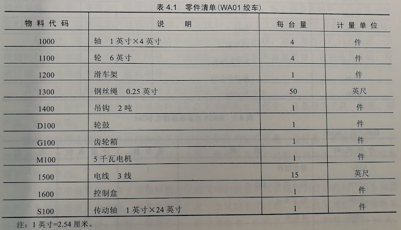
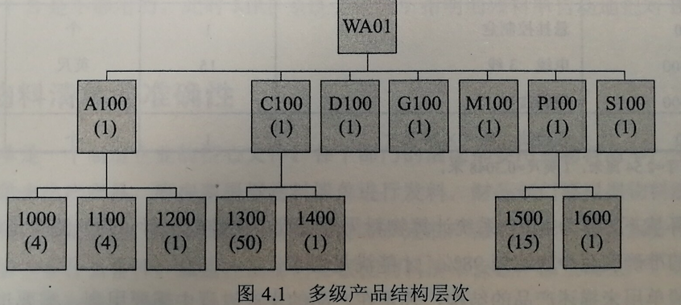
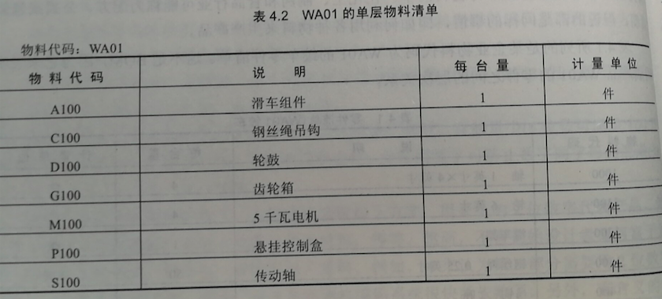
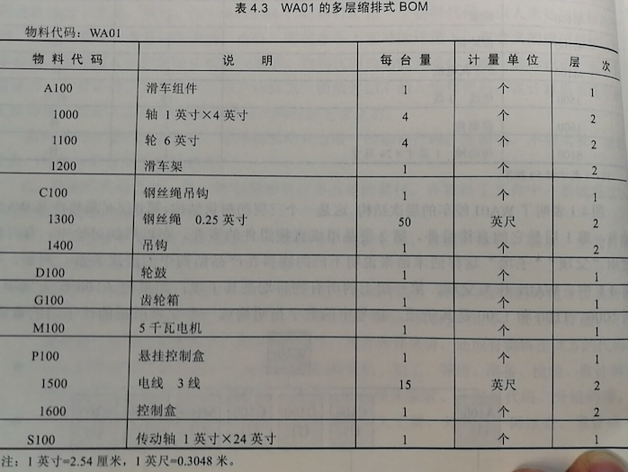
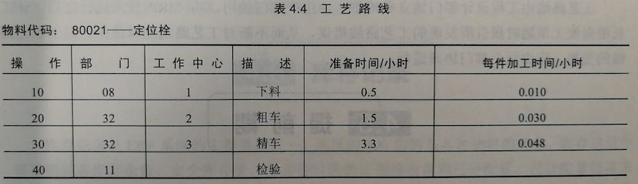

```{r setup, include=FALSE}
library(knitr)
library(kableExtra)

options(htmltools.dir.version = FALSE)
knitr::opts_chunk$set(tidy = FALSE, echo=FALSE, message=FALSE, warning=FALSE, fig.align='center')
```


## 基础数据 - 企业运营的关键

- ERP 作为计划与控制信息系统, 要进行大量的信息处理. 任何一个制造企业都有大量的生产与技术数据
- 数据必须进过加工、处理才能产生有用的信息供决策者使用
- 因此， 这些原始数据如何准确、及时、快速、可靠地送入计算机系统是至关重要的
- 经验表明, 数据不准确是许多企业实施应用 ERP 失败的重要原因. 因此, 在实施应用 ERP 的过程中, 一定要下决心采取必要的措施, 保证各项数据的完整性和准确性

---
## 物料主文件

- ERP 系统中, "物料" 一词有着广泛的含义, 它是所有产成品、半成品、在制品、原材料的总称
- 物料主文件的作用是标识和描述用于生产过程中的每一物料的属性和信息. 它是 ERP 系统最基本的文件之一
- 物料主文件中的数据项有物料代码以及同工程设计管理、物料控制和计划管理有关的信息

--
- .red[物料代码]
  - 物料的标识, 它是对每种物料的唯一编号
  - 除物料代码之外, 每一种物料还有许多其他的属性
    - 图号、物料名称、重量、体积, ...

---
## 物料清单

- 物料清单 (bill of material, BOM) 是产品结构文件, 它不仅列出某一产品的所有构成项目, 同时还要指出这些项目之间的结构关系, 即从原材料到零件、组件、直到最终产品的层次隶属关系
- 每个制造业都有物料清单. 在化工、制药和食品行业可能称为配方、公式或包装说明, 但说的都是同样的事情, 即如何利用各种物料来生产产品

---
## 物料清单

.red[零件清单]

例: 下面是某企业物料代码为 WA01的绞车零件清单. 这不是 BOM, 因为它未标明构成产品 WA01的零件之间的层次关系

```{r}

```

---
## 物料清单

.red[多级产品结构层次]

```{r}

```

---
## 物料清单

.red[单层物料清单]

- 单层物料清单: 只列出了构成产品的直接组件

```{r}

```

---
## 物料清单

.red[多层物料清单]

```{r}

```


---
## 工作中心

工作中心是用于生产产品的生产资源, 包括机器、人和设备, 是各种生产或者加工单元的总称

.red[工作中心的内容]

1. 说明生产能力的各项数据: 每班可用的人员数、机器数、机器的单台定额、每班可排产的小数数、一天开动的班次、工作中心的利用率、工作中心的效率、是否关键资源、平均排队时间等
  
2. 计算成本用的各项数据: 如单位时间的费率、工人人数、技术等级等


---
## 工作中心

.red[工作中心的作用]

1. 为平衡任务负荷与生产能力的基本单元. 运行能力需求计划 (CRP) 时以工作中心为计算单元. 分析 CRP 执行情况时也是以工作中心为单元进行投入/产出分析

2. 作为车间作业分配任务和编排详细进度的基本单元. 派工单是按每个工作中心来说明任务的优先顺序的

3. 作为计算加工成本的基本单元. 计算零件加工成本, 是以工作中心数据记录中的单位时间费率(元/工时或台时)乘以工艺路线数据记录中占用该工作中心的时间定额得出

---
## 工作中心

.red[工作中心的定义]

定义工作中心是一项细致的基础工作, 定义工作中心的关键是确保工作中心的划分与管理本企业所需的控制程度及计划能力相适应.


---
## 工艺路线

- 工艺路线是说明各项自制件的加工顺序和标准工时定额的文件, 也称为加工路线
- 工艺路线是一种计划文件而不是工艺文件. 它不详细说明加工技术条件和操作要求, 而主要说明加工过程中的工序顺序和生产资源等计划信息

```{r}

```

---
## 工艺路线

工艺路线是重要的文件, 它代表着一项作业在工厂里的运行方式. 如果说物料清单用于描述物料是按怎样的层次结构连在一起的, 那么工艺路线则是描述制造每一种物料的生产步骤和过程, 并且用于确定详细的生产进度. 工艺路线的作用如下:

1. 计算加工件的提前期, 提供运行 MRP 的计算数据
2. 提供能力需求计划 (CRP) 的计算数据
3. 提供计算加工成本的标准工时数据
4. 跟踪在制品

---
## 工艺路线

对许多企业来说, MRP 投入运行之前的一个极大的障碍就是校正工艺路线:

1. 在 MRP 试点前, 检查并校正占有80%活动的20%的工艺路线
2. 当 MRP 组件投入运行时, 使用计划下达订单提前几周指明哪条工艺路线将必须检查和校正
3. 在编制能力计划和派工单的早期, 应确保在最近将用到的工艺路线是正确的

---
## 提前期

- 任一项目从完工期算起倒退到开始日期这段时间, 称为提前期. 对制造项目而言, 提前期可分为设计提前期、采购提前期、加工提前期、装配提前期等

- 对加工装配阶段来讲, 提前期分为五类时间
  1. 排队时间
  2. 准备时间
  3. 加工时间
  4. 等待时间
  5. 传送时间
  
- 上述5类时间之和形成了加工件的生产提前期

---
## 提前期

- 通常, 一个零件在机床上的时间, 即准备时间与加工时间之和, 往往仅占生产提前期的5%~10%, 而90%以上的时间消耗在排队、等待和传送上. 就管理而言, 应该把重点放在压缩着90%的无效时间上, 如改善车间布置和物流, 改进计划减少库存积压, 合理确定生产节拍和批量等.


---
## 库存记录

- 库存记录是 ERP 系统的主要数据之一. 这里的库存指的是各种物料的库存. 库存记录中要说明现有库存余额、安全库存量、未来各时区的计划接收量和已分配量
- 为运行 ERP 系统, 库存记录的准确度要求达到95%以上

---
## 供应商主文件和客户主文件

1. 供应商主文件
  - 供应商代码、名称、地址、电话、联系人；所供应的商品名称、规格、供方物料代码；商品价格和批量要求；折扣和付款条件、货币种类、结算方式；发货地点、运输方式；供应商的信誉记录、服务情况等
  
2. 客户主文件
  - 客户代码、名称、地址、电话、联系人；所需产品名称、规格、客户方物料代码；价格、折扣、付款条件等；收货地点、结算地点；客户信誉记录等


---
## 初始数据环境的建立

- 定义关键的数据元素, 如物料代码、工艺路线、物料清单、工作中心、订货策略、项目类型和损耗率等
- 将计算机系统的信息需求与信息使用者的需求进行核对
- 定义要装入计算机系统的全部信息和信息来源。 例如， 和一项物料有关的信息可能有15-20个不同的数据项， 仅要求其中的4-5项装入计算机系统, 其他数据项可以以后再装入或者根本不用. 所以要确定哪些数据项是要求的, 哪些可能永远不用.
- 指定适当的人将数据装入计算机, 限定完成任务的时间, 并进行审核
- 有些数据元素不是常数, 时常会变化, 其变化情况必须在计算机系统里得到反映, 定期检查、修改


